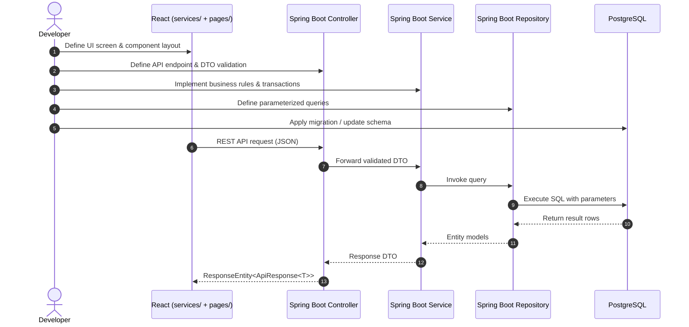

# Vibe Full-Stack Development Skill

This skill enforces the global Vibe Coding priority hierarchy and strict architectural governance:

**SECURITY > CORRECTNESS > EXISTING FUNCTIONALITY > PERFORMANCE > MAINTAINABILITY > SIMPLICITY**

## 1. Strict Architecture Boundaries

### Backend Packages (ONLY these):
`src/main/java/<base-package>/`
- `entity/` — JPA entities & constraints only. No business logic.
- `repository/` — Database queries & `JpaRepository` only. No business logic.
- `service/` — All business rules, transactions (`@Transactional`), validations.
- `controller/` — HTTP handling, DTO mapping, status codes only. Never call repository directly.
- `dto/` — Request/response contracts. Never expose sensitive fields.

### Frontend Folders (ONLY these):
`src/`
- `components/` — Reusable UI elements only.
- `pages/` (or `app/`) — Complete screen views.
- `services/` — Centralized REST API calls only.
- `hooks/` — Reusable state, geolocation, and behavior logic.

## 2. Full-Stack Feature Execution Cycle

## 3. Mandatory Security Standards
1. **Passwords**: Never stored as plaintext. Use BCrypt. Never return or log passwords.
2. **Backend Authorization**: Never trust frontend flags like `isAdmin: true` or `userRole`. Verify claims from the JWT on the backend.
3. **SQL Injection Protection**: All queries must use Spring Data JPA or parameterized native queries. Never concatenate SQL strings with user input.
4. **Input Validation**: Validate every request field with Jakarta `@Valid` annotations on the backend.
5. **No Secret Exposure**: Never put database credentials, private keys, or third-party secret tokens in frontend code.

## 4. Mandatory Performance Standards
1. **No Duplicate Calls**: Debounce search queries.
2. **Pagination**: Always paginate queries when results could grow beyond 20 items.
3. **Database Indexes**: Index foreign keys, search columns, and coordinates (`latitude`, `longitude`).
4. **Zero N+1 Queries**: Use `JOIN FETCH` or batch size configuration.

## 5. Strict 28-Point Final Verification
Before considering any task complete, verify:

- [ ] **Architecture**: Backend uses ONLY `entity/`, `service/`, `controller/`, `repository/`, `dto/`.
- [ ] **Architecture**: Frontend uses ONLY `components/`, `pages/`, `services/`, `hooks/`.
- [ ] **Backend**: Controller contains zero business logic and does not call Repository.
- [ ] **Backend**: Service contains all business logic and transaction boundaries.
- [ ] **API**: Proper HTTP methods, meaningful URLs, correct status codes (`200`, `201`, `400`, `401`, `403`, `404`).
- [ ] **Security**: Backend authorization enforced; passwords hashed; no secrets leaked.
- [ ] **Database**: Parameterized queries; no N+1 queries; indexes on search columns.
- [ ] **Testing**: Backend compiles (`mvn clean test-compile`); frontend compiles (`npm run build`).
