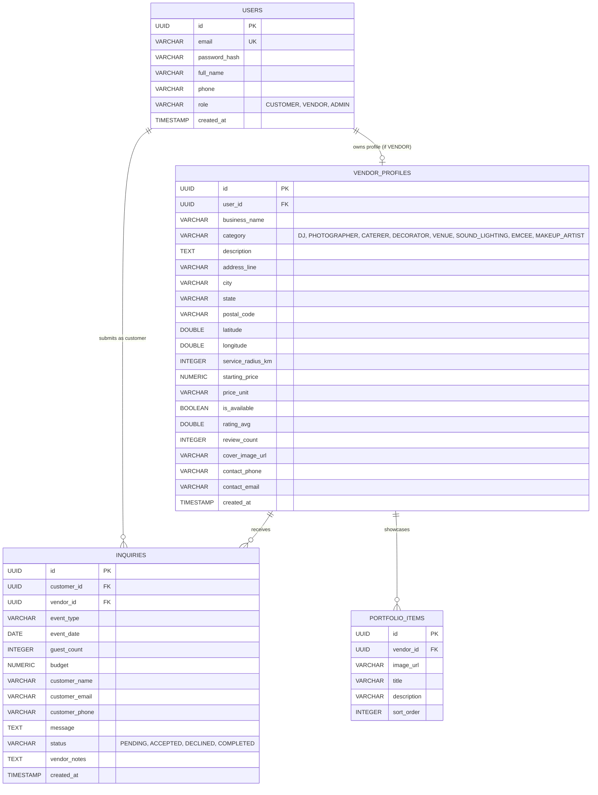

# 📖 Project Context: EventPulse (Two-Sided Event Service Marketplace)

> **Document Version:** 1.0.0  
> **Target Audience:** Engineering Team & AI Coding Agents  
> **Core Stack:** Spring Boot 3 (Java 21) • React 19 / Next.js 16 • PostgreSQL 18 • PostGIS / Native Spatial Trigonometry • REST APIs  
> **Associated Documents:** [README.md](file:///d:/PROJECT/event/README.md) • [GEMINI.md](file:///d:/PROJECT/event/GEMINI.md) • [frontend/README.md](file:///d:/PROJECT/event/frontend/README.md) • [backend/README.md](file:///d:/PROJECT/event/backend/README.md)

---

## 1. Executive Summary & Vision

**EventPulse** is a specialized two-sided marketplace designed to connect event organizers (**Customers**) with local verified event professionals and equipment owners (**Vendors / Owners**).

### Actors & User Personas
1. **Customers (Event Hosts / Organizers):**
   - Search for specific event talent: **DJs, Photographers, Caterers, Decorators, Venues, Sound & Lighting, Emcees, and Makeup Artists**.
   - Discover talent ordered by **real-time physical proximity** (nearest to farthest) calculated from GPS or selected city coordinates.
   - Filter by dynamic search radius (5 km – 50 km) and view exact category headcounts (*"Found 8 Caterers within 15 km"*).
   - Review portfolios, pricing packages, verified badges, and submit direct booking inquiries.
   - Track booking response statuses (`PENDING`, `ACCEPTED`, `DECLINED`) from a dedicated dashboard.

2. **Vendors / Owners (Service Providers & Equipment Owners):**
   - Create public business profiles with category, base pricing, service radius (km), portfolio gallery, and exact map coordinates.
   - Receive incoming customer booking inquiries in real time with event details (date, guest count, estimated budget, message).
   - Accept or decline leads with custom notes and direct contact details.
   - Toggle instant booking availability (`Open for Bookings` vs. `Fully Booked`).

---

## 2. Strict Architectural Governance

In accordance with [GEMINI.md](file:///d:/PROJECT/event/GEMINI.md), this codebase follows strict package and folder boundaries.

### Priority Hierarchy
$$\text{SECURITY} > \text{CORRECTNESS} > \text{EXISTING FUNCTIONALITY} > \text{PERFORMANCE} > \text{MAINTAINABILITY} > \text{SIMPLICITY}$$

### 2.1 Backend Package Architecture (`backend/src/main/java/com/eventpulse/`)
Only the following application packages are permitted:

```
com.eventpulse/
├── entity/         # JPA entities & relational mappings ONLY
├── repository/     # Spring Data JPA interfaces & database queries ONLY
├── service/        # All business logic, validations, transactions (@Transactional)
│   └── impl/       # Concrete service implementations
├── controller/     # HTTP/REST request mapping, DTO validation, status codes ONLY
└── dto/            # Request and response Data Transfer Objects
```

*Rule:* Controllers MUST NOT contain business logic and MUST NEVER directly access Repositories.

### 2.2 Frontend Folder Architecture (`frontend/`)
Only the following directories are permitted for application logic:

```
frontend/
├── app/            # Route screens (Next.js App Router)
├── components/     # Reusable UI elements (Navbar, VendorMap, ui/map)
├── services/       # Centralized REST API communication (api.ts, authService.ts)
└── hooks/          # Reusable state & behavior hooks (useAuth.ts)
```

---

## 3. Database & Spatial Engine (PostgreSQL)

### 3.1 Database Overview
- **Engine:** PostgreSQL 18
- **Database Name:** `event_marketplace`
- **Default Port:** `5432`
- **Dialect:** `org.hibernate.dialect.PostgreSQLDialect`
- **Configuration:** [application.yml](file:///d:/PROJECT/event/backend/src/main/resources/application.yml)

### 3.2 Relational Entity Schema


### 3.3 Spatial Math Engine
Distance calculation is executed natively inside PostgreSQL via high-precision spherical trigonometry:

$$\text{distance} = 6371 \times \arccos\left(\cos(\text{lat}_1) \cos(\text{lat}_2) \cos(\text{lng}_2 - \text{lng}_1) + \sin(\text{lat}_1) \sin(\text{lat}_2)\right)$$

```sql
SELECT 
    v.id,
    v.business_name AS businessName,
    v.category AS category,
    v.latitude AS latitude,
    v.longitude AS longitude,
    v.starting_price AS startingPrice,
    ROUND(CAST(
        (6371 * acos(
            cos(radians(:lat)) * cos(radians(v.latitude)) *
            cos(radians(v.longitude) - radians(:lng)) +
            sin(radians(:lat)) * sin(radians(v.latitude))
        )) AS numeric), 2
    ) AS distanceKm
FROM vendor_profiles v
WHERE v.is_available = true
  AND (:category IS NULL OR v.category = :category)
  AND (
    6371 * acos(
        cos(radians(:lat)) * cos(radians(v.latitude)) *
        cos(radians(v.longitude) - radians(:lng)) +
        sin(radians(:lat)) * sin(radians(v.latitude))
    )
  ) <= :radiusKm
ORDER BY distanceKm ASC;
```

---

## 4. REST API Specification

### 4.1 Authentication & Profile (`/api/auth`)
| Method | Endpoint | Auth | Description |
| :--- | :--- | :--- | :--- |
| `POST` | `/api/auth/register` | Public | Register a new Customer or Vendor profile |
| `POST` | `/api/auth/login` | Public | Authenticate credentials and receive JWT |
| `GET` | `/api/auth/me` | Bearer | Retrieve authenticated user session and role |

### 4.2 Vendor Discovery & Proximity (`/api/vendors`)
| Method | Endpoint | Auth | Description |
| :--- | :--- | :--- | :--- |
| `GET` | `/api/vendors/search` | Public | Nearest vendor list sorted by `distanceKm ASC` |
| `GET` | `/api/vendors/count-nearby` | Public | Aggregated counts grouped by category |
| `GET` | `/api/vendors/{id}` | Public | Detailed vendor profile with portfolio & calculated distance |
| `GET` | `/api/vendors/all` | Public | Fallback directory listing |

### 4.3 Inquiries & Bookings (`/api/inquiries`)
| Method | Endpoint | Auth | Description |
| :--- | :--- | :--- | :--- |
| `POST` | `/api/inquiries` | Customer | Submit a new event booking inquiry |
| `GET` | `/api/inquiries/my-inquiries` | Customer | Fetch all inquiries submitted by the customer |
| `GET` | `/api/inquiries/vendor-inbox` | Vendor | Fetch incoming customer inquiries for vendor |
| `PATCH`| `/api/inquiries/{id}/status`| Vendor | Update inquiry status (`ACCEPTED`, `DECLINED`) |

### 4.4 Vendor Management Portal (`/api/vendor-portal`)
| Method | Endpoint | Auth | Description |
| :--- | :--- | :--- | :--- |
| `GET` | `/api/vendor-portal/profile` | Vendor | Fetch current vendor business details |
| `PUT` | `/api/vendor-portal/profile` | Vendor | Update business profile, address, and coordinates |
| `PATCH`| `/api/vendor-portal/availability`| Vendor | Toggle active booking status |
| `POST` | `/api/vendor-portal/portfolio` | Vendor | Add a new portfolio photo item |
| `DELETE`| `/api/vendor-portal/portfolio/{id}` | Vendor | Remove a portfolio photo item |

---

## 5. Frontend Architecture & Multi-Page Routes

### 5.1 Route Structure (`frontend/app/`)
- **[`/` (Marketplace Explorer)](file:///d:/PROJECT/event/frontend/app/page.tsx):**
  - Split-view interface: left filterable vendor cards with proximity tags (`🚗 1.37 km away`), right interactive OpenStreetMap.
  - Live radius slider (5 km – 50 km).
  - Category pill tabs with dynamic counts (`DJ (1)`, `Photographer (1)`, etc.).
  - Direct inquiry booking modal.
- **[`/login` (Authentication)](file:///d:/PROJECT/event/frontend/app/login/page.tsx):**
  - Email/password authentication form.
  - 1-click quick demo buttons (*Sarah - Customer* and *DJ Alex - Vendor*).
- **[`/register` (Dual Registration)](file:///d:/PROJECT/event/frontend/app/register/page.tsx):**
  - Dual registration tabs: **Customer Account** vs. **Vendor Business Listing** (with category, address, starting price).
- **[`/my-inquiries` (Customer Dashboard)](file:///d:/PROJECT/event/frontend/app/my-inquiries/page.tsx):**
  - Customer booking tracker with status badges (`PENDING`, `ACCEPTED`, `DECLINED`) and direct vendor phone calling.
- **[`/vendor` (Vendor Dashboard)](file:///d:/PROJECT/event/frontend/app/vendor/page.tsx):**
  - Vendor leads inbox with accept/decline actions and instant availability toggle.

### 5.2 Mapping Infrastructure
- **Leaflet & OpenStreetMap ([components/VendorMap.tsx](file:///d:/PROJECT/event/frontend/components/VendorMap.tsx)):**
  - Uses official OpenStreetMap raster tiles (`tile.openstreetmap.org`) with **0 watermarks** and **no API keys required**.
  - Renders circular glowing pin badges with category emojis (`🎧`, `📸`, `🍽️`, `✨`, `🏰`, `🔊`, `🎤`).
  - Interactive popup cards displaying vendor starting prices and distances.
- **MapLibre Declarative Library ([components/ui/map.tsx](file:///d:/PROJECT/event/frontend/components/ui/map.tsx)):**
  - Exposes `<Map>`, `<MapMarker>`, `<MarkerContent>`, `<MarkerPopup>`, `<MarkerTooltip>`.

---

## 6. Seed Accounts for Testing

| Persona | Email | Password | Role | Specialization |
| :--- | :--- | :--- | :--- | :--- |
| **Customer** | `customer@example.com` | `password123` | `CUSTOMER` | Event Host (Sarah Jenkins) |
| **DJ Owner** | `dj.alex@example.com` | `password123` | `VENDOR` | Sonic Pulse DJ (Indiranagar) |
| **Photographer** | `photo.rohit@example.com` | `password123` | `VENDOR` | Lumière Candid Photography (Koramangala) |
| **Caterer** | `cater.ananya@example.com` | `password123` | `VENDOR` | Royal Feast Gourmet Catering (HSR Layout) |
| **Decorator** | `decor.priya@example.com` | `password123` | `VENDOR` | Petal & Glow Bespoke Decor (Jayanagar) |
| **Venue Owner** | `venue.vikram@example.com` | `password123` | `VENDOR` | The Grand Palm Pavilion (Whitefield) |
| **Sound & Light**| `sound.karan@example.com` | `password123` | `VENDOR` | Acoustic Pro Concert Audio (JP Nagar) |
| **Emcee / Host** | `emcee.rohan@example.com` | `password123` | `VENDOR` | Host Rohan Bilingual Anchor (MG Road) |
