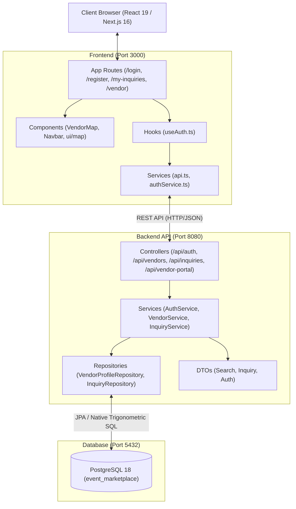

# 🌟 EventPulse — Two-Sided Event Services Marketplace

[](https://spring.io/projects/spring-boot)
[](https://nextjs.org/)
[](https://react.dev/)
[](https://www.postgresql.org/)
[](https://leafletjs.com/)

**EventPulse** is a two-sided event services and vendor marketplace connecting event organizers (**Customers**) with verified local event talent and equipment owners (**Vendors / Owners**) such as **DJs, Photographers, Caterers, Decorators, Venues, Sound & Lighting, Emcees, and Makeup Artists**.

Featuring real-time geospatial search, proximity calculation, interactive map exploration, direct lead generation, inquiry status tracking, and vendor lead management.

---

## 📑 Table of Contents

- [Core Features](#-core-features)
- [System Architecture](#-system-architecture)
- [Tech Stack](#-tech-stack)
- [Geospatial Proximity Engine](#-geospatial-proximity-engine)
- [Project Directory Structure](#-project-directory-structure)
- [Getting Started & Local Setup](#-getting-started--local-setup)
  - [1. Database Configuration](#1-database-configuration)
  - [2. Backend Setup (Spring Boot)](#2-backend-setup-spring-boot)
  - [3. Frontend Setup (Next.js & React)](#3-frontend-setup-nextjs--react)
- [Pre-Seeded Demo Accounts](#-pre-seeded-demo-accounts)
- [REST API Catalog](#-rest-api-catalog)
- [Frontend Multi-Page Routes](#-frontend-multi-page-routes)
- [Architectural Rules & Compliance](#-architectural-rules--compliance)

---

## 🚀 Core Features

### 👤 Customer Experience (Event Organizers)
- **Live Proximity Search:** Find vendors ordered strictly from nearest to farthest (`0.85 km`, `1.37 km`, etc.) relative to your current location or selected city hub.
- **Dynamic Radius Filter:** Adjust search distance from **5 km to 50 km** with instant count indicators (*"Found 8 Caterers within 15 km"*).
- **Interactive Map Exploration:** Split view with real-time OpenStreetMap markers with category-specific emojis and starting price pills.
- **Booking Inquiries:** Direct booking requests detailing event date, guest count, estimated budget, and custom requirements.
- **Customer Inquiry Tracker (`/my-inquiries`):** Real-time status tracker (`PENDING`, `ACCEPTED`, `DECLINED`) with direct phone contact to accepted vendors.

### 🏢 Vendor & Owner Experience (Event Talent & Equipment)
- **Multi-Category Business Listings:** Register as DJ, Photographer, Caterer, Decorator, Venue, Sound & Lighting, Emcee, or Makeup Artist.
- **Vendor Lead Management (`/vendor`):** Instant leads inbox to review incoming customer inquiries, event dates, budgets, and guest counts.
- **One-Click Lead Actions:** Accept or decline booking inquiries with personalized response notes.
- **Live Availability Toggle:** Toggle real-time status between *"Open for Bookings"* and *"Fully Booked"*.
- **Address & Coordinate Mapping:** Automated lat/lng geocoding and coverage radius definition.

---

## 🏗️ System Architecture



---

## 🛠️ Tech Stack

| Layer | Technologies |
| :--- | :--- |
| **Frontend** | **Next.js 16.4.0** (App Router), **React 19.3.0**, **TypeScript 5**, **Tailwind CSS 4** |
| **Maps & Geospatial** | **Leaflet 1.9.4**, **OpenStreetMap Tiles** (100% watermark-free), **MapLibre GL 6.13.0** |
| **Backend** | **Java 21**, **Spring Boot 3.3.4**, **Spring Security 6**, **Spring Data JPA** |
| **Authentication** | **JWT (JSON Web Tokens)** via JJWT (`0.12.6`), **BCrypt Password Hashing** |
| **Database** | **PostgreSQL 18** (`event_marketplace`) |
| **Build & Tooling** | **Maven 3.9+**, **Turbopack**, **Node.js 20+** |

---

## 📍 Geospatial Proximity Engine

Distance calculation is executed natively inside PostgreSQL using spherical Haversine trigonometry, eliminating any heavy external GIS dependencies while maintaining sub-millisecond execution:

$$\text{distance} = 6371 \times \arccos\left(\cos(\text{lat}_1) \cos(\text{lat}_2) \cos(\text{lng}_2 - \text{lng}_1) + \sin(\text{lat}_1) \sin(\text{lat}_2)\right)$$

### Native Spatial SQL Query:
```sql
SELECT 
    v.id,
    v.business_name AS businessName,
    v.category AS category,
    v.latitude AS latitude,
    v.longitude AS longitude,
    v.starting_price AS startingPrice,
    ROUND(CAST(
        (6371 * acos(
            cos(radians(:lat)) * cos(radians(v.latitude)) *
            cos(radians(v.longitude) - radians(:lng)) +
            sin(radians(:lat)) * sin(radians(v.latitude))
        )) AS numeric), 2
    ) AS distanceKm
FROM vendor_profiles v
WHERE v.is_available = true
  AND (:category IS NULL OR v.category = :category)
  AND (
    6371 * acos(
        cos(radians(:lat)) * cos(radians(v.latitude)) *
        cos(radians(v.longitude) - radians(:lng)) +
        sin(radians(:lat)) * sin(radians(v.latitude))
    )
  ) <= :radiusKm
ORDER BY distanceKm ASC;
```

---

## 📂 Project Directory Structure

Adhering strictly to [GEMINI.md](file:///d:/PROJECT/event/GEMINI.md) project governance rules:

```
d:/PROJECT/event/
├── backend/
│   ├── pom.xml
│   └── src/main/java/com/eventpulse/
│       ├── controller/       # REST API Endpoints only
│       │   ├── AuthController.java
│       │   ├── InquiryController.java
│       │   ├── VendorController.java
│       │   └── VendorPortalController.java
│       ├── dto/              # Request / Response Data Transfer Objects
│       │   ├── AuthRequest.java, AuthResponse.java, RegisterRequest.java
│       │   ├── InquiryRequest.java, InquiryResponse.java, InquiryStatusUpdateDto.java
│       │   └── VendorSearchResponse.java, VendorDetailResponse.java, CategoryCountResponse.java
│       ├── entity/           # JPA Entities & Table Mappings
│       │   ├── User.java, VendorProfile.java, Inquiry.java, PortfolioItem.java
│       │   └── enums/ (Role, VendorCategory, InquiryStatus)
│       ├── repository/       # Database queries & spatial queries
│       │   ├── UserRepository.java
│       │   ├── VendorProfileRepository.java
│       │   ├── InquiryRepository.java
│       │   └── PortfolioItemRepository.java
│       └── service/          # Business logic, transactions, validations
│           ├── AuthService.java & AuthServiceImpl.java
│           ├── VendorService.java & VendorServiceImpl.java
│           ├── InquiryService.java & InquiryServiceImpl.java
│           └── DatabaseDataInitializer.java (Pre-seeds 7 event vendors)
│
├── frontend/
│   ├── package.json
│   ├── app/                  # Application Routes
│   │   ├── page.tsx          # Marketplace Explorer (Map + Cards)
│   │   ├── login/            # Login screen (with 1-click test logins)
│   │   ├── register/         # Dual registration (Customer vs Vendor)
│   │   ├── my-inquiries/     # Customer booking tracker
│   │   └── vendor/           # Vendor leads inbox & dashboard
│   ├── components/           # Reusable UI components
│   │   ├── Navbar.tsx        # Dynamic navigation & role badges
│   │   ├── VendorMap.tsx     # Leaflet map with custom emoji pins
│   │   └── ui/map.tsx        # Declarative MapLibre wrapper
│   ├── services/             # Centralized REST API calls
│   │   ├── api.ts            # Base fetch wrapper with JWT interceptor
│   │   └── authService.ts    # Authentication API calls
│   └── hooks/                # Custom React hooks
│       └── useAuth.ts        # Client-side session and auth state
│
├── PROJECT_CONTEXT.md        # Technical architecture & schema reference
├── GEMINI.md                 # Architectural rules & coding guidelines
└── README.md                 # Project documentation
```

---

## ⚡ Getting Started & Local Setup

### Prerequisites
- **Java 21 JDK** or newer
- **Node.js 20+** and **npm**
- **PostgreSQL 18+**

---

### 1. Database Configuration

Create the PostgreSQL database:
```sql
CREATE DATABASE event_marketplace;
```

---

### 2. Environment Variables Configuration

#### Backend (`backend/.env`)
Ensure `backend/.env` exists (copied from `backend/.env.example`):
```env
SERVER_PORT=8080
DB_HOST=localhost
DB_PORT=5432
DB_NAME=event_marketplace
DB_USER=postgres
DB_PASSWORD=1234
JWT_SECRET=404E635266556A586E3272357538782F413F4428472B4B6250645367566B5970
JWT_EXPIRATION_MS=86400000
CORS_ALLOWED_ORIGINS=http://localhost:3000,http://localhost:5173,http://localhost:3001
```

#### Frontend (`frontend/.env.local`)
Ensure `frontend/.env.local` exists (copied from `frontend/.env.example`):
```env
NEXT_PUBLIC_API_URL=http://localhost:8080/api
```

---

### 3. Backend Setup (Spring Boot)

1. Open a terminal in `backend/`:
   ```bash
   cd backend
   ```
2. Build and run the Spring Boot application:
   ```bash
   mvn spring-boot:run
   ```
3. The server starts on **`http://localhost:8080`**.
4. *On initial startup, `DatabaseDataInitializer` automatically populates 7 realistic vendor profiles across Bangalore city hubs.*

---

### 4. Frontend Setup (Next.js & React)

> ⚠️ **CRITICAL NOTE:** Always use `npm run dev` to start the frontend locally. Never use `npm run build` for local development.

1. Open a terminal in `frontend/`:
   ```bash
   cd frontend
   ```
2. Install dependencies:
   ```bash
   npm install
   ```
3. Start the Turbopack development server:
   ```bash
   npm run dev
   ```
4. Access the web application at **`http://localhost:3000`**.

---

## 👥 Pre-Seeded Demo Accounts

Every account password is `password123`:

| Role | Name | Email | Password | Location / Focus |
| :--- | :--- | :--- | :--- | :--- |
| **Customer** | Sarah Jenkins | `customer@example.com` | `password123` | Event Organizer |
| **DJ** | Alex Rivera | `dj.alex@example.com` | `password123` | Sonic Pulse DJ (Indiranagar) |
| **Photographer** | Rohit Shetty | `photo.rohit@example.com` | `password123` | Lumière Candid Photography (Koramangala) |
| **Caterer** | Ananya Sharma | `cater.ananya@example.com` | `password123` | Royal Feast Gourmet Catering (HSR Layout) |
| **Decorator** | Priya Mehta | `decor.priya@example.com` | `password123` | Petal & Glow Bespoke Decor (Jayanagar) |
| **Venue Owner**| Vikram Singhania| `venue.vikram@example.com` | `password123` | The Grand Palm Pavilion (Whitefield) |
| **Sound & Light**| Karan Joshi | `sound.karan@example.com` | `password123` | Acoustic Pro Concert Audio (JP Nagar) |
| **Emcee / Host** | Rohan Kapoor | `emcee.rohan@example.com` | `password123` | Host Rohan Bilingual Anchor (MG Road) |

> 💡 **Quick Login:** The `/login` page includes **1-Click Demo Login** buttons for instant testing without manual typing.

---

## 📡 REST API Catalog

### 🔐 Authentication (`/api/auth`)
| Method | Endpoint | Access | Description |
| :--- | :--- | :--- | :--- |
| `POST` | `/api/auth/register` | Public | Register customer or vendor account |
| `POST` | `/api/auth/login` | Public | Authenticate user & return JWT token |
| `GET` | `/api/auth/me` | Bearer | Get authenticated user info & role |

### 🔍 Vendor Discovery & Proximity (`/api/vendors`)
| Method | Endpoint | Access | Description |
| :--- | :--- | :--- | :--- |
| `GET` | `/api/vendors/search?lat={lat}&lng={lng}&radiusKm={km}&category={cat}` | Public | Proximity-sorted vendor listing |
| `GET` | `/api/vendors/count-nearby?lat={lat}&lng={lng}&radiusKm={km}` | Public | Category breakdown count |
| `GET` | `/api/vendors/{id}?lat={lat}&lng={lng}` | Public | Full profile, portfolio, and distance |
| `GET` | `/api/vendors/all` | Public | All available vendor directory |

### 📨 Inquiries & Leads (`/api/inquiries`)
| Method | Endpoint | Access | Description |
| :--- | :--- | :--- | :--- |
| `POST` | `/api/inquiries` | Customer | Create new booking inquiry |
| `GET` | `/api/inquiries/my-inquiries` | Customer | List all inquiries submitted by customer |
| `GET` | `/api/inquiries/vendor-inbox` | Vendor | List incoming leads for logged-in vendor |
| `PATCH` | `/api/inquiries/{id}/status` | Vendor | Update lead status (`ACCEPTED`, `DECLINED`) |

### 🛠️ Vendor Portal (`/api/vendor-portal`)
| Method | Endpoint | Access | Description |
| :--- | :--- | :--- | :--- |
| `GET` | `/api/vendor-portal/profile` | Vendor | Retrieve current vendor business profile |
| `PUT` | `/api/vendor-portal/profile` | Vendor | Update business profile & coordinates |
| `PATCH` | `/api/vendor-portal/availability` | Vendor | Toggle availability status |
| `POST` | `/api/vendor-portal/portfolio` | Vendor | Add photo to vendor portfolio |
| `DELETE` | `/api/vendor-portal/portfolio/{id}`| Vendor | Delete item from vendor portfolio |

---

## 🌐 Frontend Multi-Page Routes

1. **`/` — Marketplace Explorer:**
   - Real-time GPS detection & city selector (Bangalore, Mumbai, Delhi).
   - Radius slider (5 km – 50 km).
   - Category filter pills with dynamic count badges (`🎧 DJ (1)`, `📸 Photographer (1)`).
   - Split view: left scrollable vendor cards with distance indicators (`🚗 1.37 km away`), right interactive OpenStreetMap.
   - Direct booking inquiry modal.
2. **`/login` — Dedicated Login:**
   - Email/password authentication.
   - Quick 1-click demo logins for Customer and Vendor personas.
3. **`/register` — Dual Registration:**
   - Seamless tabs for **Customer Account** vs **Vendor Business Listing**.
   - Vendor registration captures business name, category, pricing, and address.
4. **`/my-inquiries` — Customer Dashboard:**
   - View all booking requests submitted by the logged-in customer.
   - Real-time status tags (`PENDING`, `ACCEPTED`, `DECLINED`).
   - Direct phone link to contact vendors once accepted.
5. **`/vendor` — Vendor Leads Inbox:**
   - Incoming inquiries inbox showing event date, guest count, budget, and message.
   - One-click Accept / Decline actions with response note modal.
   - Live booking availability toggle (*"Open for Bookings"* vs *"Fully Booked"*).

---

## 🛡️ Architectural Rules & Compliance

This repository enforces strict clean-architecture separation:
1. **Zero Forbidden Directories:** No non-standard packages (`config/`, `utils/`, `helpers/`, `context/`, `redux/`, etc.). Backend strictly uses `entity/`, `service/`, `controller/`, `repository/`, and `dto/`. Frontend strictly uses `components/`, `app/`, `services/`, and `hooks/`.
2. **Single Direction Dependency Flow:** Controller $\to$ Service $\to$ Repository $\to$ Entity $\to$ PostgreSQL. Controllers never access repositories directly.
3. **Security Standards:** Passwords hashed with BCrypt. JWT stored securely in client storage. Sensitive credentials never sent to the client.
4. **SQL Injection Free:** Parameterized JPA native queries for geospatial trigonometry.
5. **Tile Compliance:** 100% watermark-free OpenStreetMap standard tiles (`tile.openstreetmap.org`) with no expired or unauthorized third-party keys.

---

## 📄 License & Attribution

Built for the EventPulse marketplace project. All rights reserved.
